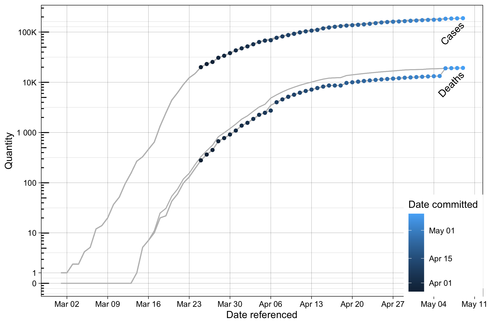

This is a collection of scripts for continual analysis of revisions to public
data which tracks the number of cases of and deaths from SARS-CoV-in the US. It
includes a `git submodule` based scheme to keep the repository in sync with
various public data sources, a `makefile` to extract from these repositories a
comprehensive history of all versions of the datasets of interest, and an
analysis script to analyze and visualize this revisioning. Currently, these
scripts include full or partial support for the following data sources, but
others may be added:

- [nytimes/covid-19-data](https://github.com/marcusrussi/reporting-delay-data)
  NYTimes' county-level case and death data
  - ✓ reprocessing
  - ✓ analysis
  - ✓ graphs
- [COVID19Tracking/covid-tracking-data](https://github.com/COVID19Tracking/covid-tracking-data)
  The COVID Tracking Project's daily-aggregated state-level data
  - ✓ reprocessing
  - ✗ analysis (WIP)
  - ✗ graphs (WIP)

## Usage

GNU Parallel is required. Install GNU Parallel
[here](https://www.gnu.org/software/parallel/).


```bash
git clone https://github.com/marcusrussi/reporting-delay-data && cd reporting-delay-data
git submodule init
git submodule update
make data # Generates the history files into data-products/
```

Running `make data` will generate, into `data-products/`, the history of
NYTimes' [county-level confirmed-cases
data](https://github.com/nytimes/covid-19-data), and the history of the Covid
Tracking Project's [state-level
data](https://github.com/covid19Tracking/covid-tracking-data).

An accompanying R script, `R/script.R` provides utilities to analyze and
vizualize the history of this data. Currently, it is configued for analyzing
the NYTimes data, but future modifications will be made to support a broader
array of data sources.

Note that the column added by the history-processing script, `date_committed`,
is a UNIX timestamp, not a regular date.  In R, UNIX timestamps can be easily
parsed by using the `anytime` package.

## Staying current

In order to regenerate files in `data-products` as source data changes, invoke
`make` as follows, every day or so:

```bash
make -B data
```

## Example

```r
source("R/sketch.R")

plot_discrepancy(incidence, state_="New York") # Plot of cases&deaths for NYS
plot_deltas(deltas_prevalence) # Plot of revisioning actions for entire US
```
